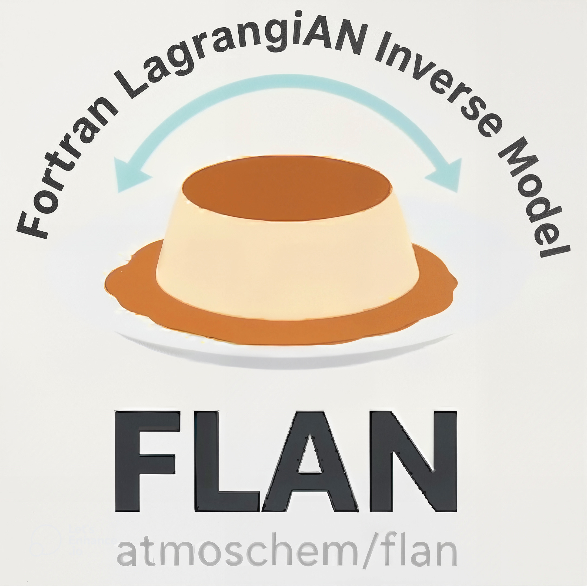

# Fortran LAgrangiaN Inverse Model (FLAN)
My cool new project!

#TODO EVERYTHING

Cool thing, it is an [fpm](https://fpm.fortran-lang.org/index.html) project that already compiles with

- LAPACK
- BLAS
- STDLIB
- NETCDF
- OPENMP

